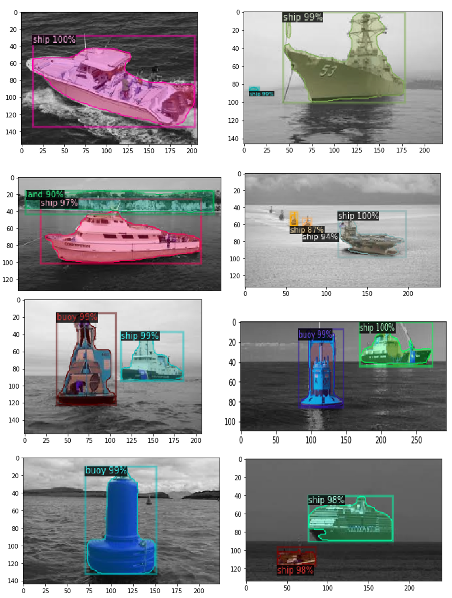

# Marine Object Image Segmentation using FAIR's Detectron2
This repository was inspired by the following Detectron2 tutorial:

https://colab.research.google.com/drive/16jcaJoc6bCFAQ96jDe2HwtXj7BMD_-m5

This tutorial is what led to this repository.

According to Facebook AI Research (FAIR), "Detectron2 is Facebook AI Research's next generation software system that implements state-of-the-art object detection algorithms". 

https://github.com/facebookresearch/detectron2

## Objectives
The objective of this project is to recognize nautical objects like buoys, ships or land forms while at sea using a video camera for real-time warnings. We plan on installing a low power drain Jetson Xavier on a boat with a video camera(s) to detect these nautical objects. This project is actually a follow up to Adrian Llopart Maurin's GitHub repository where he used Mask RCNN to train and predict Marine objects typically encountered at sea. Adrian labeled his images (using labelme?) to detect ships, buoys, land, sea and sky. This is agreat objective, but we have decided only to predict ships, buoys and land forms in this repository. 

https://github.com/Allopart/Maritme_Mask_RCNN

We used Adrian's Marine image dataset as our training set, which also included all of his the labelme .json file labels.  Adrian used a Panoptic Segmentation approach were he labeled the entire image for ships, buoys, land, sea and sky. For this repository; however, we edited Adrian's nautical images and labels in labelme and eliminated sea and sky. For our next panoptic segmentation project coming up next if we can figure out how to train for this (errors now in Colab training), we will go back to Arian's comprehensive labeling approach.

## Marine Labels
The following image is an example of an buoy being labeled in labelme to be used in training. 

Adrian's training dataset was composed of images and separate .json for each image. We used Chengwei Zhang's GitHub repository (see link below) to combine all the individual .json files obtained on each image. Labelme creates these individual json files from each image. With Chengwei's program we created the single trainval.json file used in training by Detectron2. We ran Chengwei's program using the following command line: 

  python labelme2coco.py .data/images

https://github.com/Tony607/labelme2coco

Chengwei also included a notebook that was created to evaluate and scan the individual image results as a qc check before starting the training in Colab. This notebook is called COCO_Image_Viewer.ipynb, and it too is included in this repository with thanks to Chengwei.

## Data used for Training
A subset to Adrian's images ca be accessed from the following AWS source:

https://cbpetro.s3.us-east-2.amazonaws.com/api/download/data.zip

This creates a folder called data and within this folder is the single trainval.json file and a folder called "images". We did observe that in the training, Detectron2 did not accept images in the portrait mode. Images in the portrait mode were eliminated from the training set. We used the following Colab notebook to train this nautical dataset on Colab:

  Detectron2_custom_coco_data_instance_segmentation_marine_ver5_TRAIN_Colab.ipynb

Colab generates a weights file that are are stored in the Colab "/output/model_final.pth" directory. After performing the training, this file can be accessed in Colab by tapping on the folder icon to the very far left in the area of the Table of Contents in Colab and downloading the file. The weights are downloaded to your Download directory and can be placed in your Detectron2 project directory as "./output/model_fina.pth". 

Our nautical training weights can be downloaded from the following AWS link. Just click on it. 

https://cbpetro.s3.us-east-2.amazonaws.com/api/download/output.zip

## Predict Nautical Objects
We used the following notebook to then predict our nautical objects like buoys, ships and land features from a validation image set downloaded from the web discussed below:

  Detectron2_COCO_DataSegmentation_from_Marine_checkpoints.ipynb

or you can use the following python code in Spyder:

  Detectron2_COCO_DataSegmentation_from_Marine_checkpoints.py

We provide a data_val subdirectory with this GitHub repository. This folder has numerous images of nautical objects, all of which were not used in training process. These images are being used as validation of our model. The instance segmentation process appears to be working rather well as can be observed in the images below. 

At this time we are a bit unclear as to how to employ a validation set in the actual Detectron2 training process. This will be added at a later date if found to add value, which it should.  

Tools being employed:

- Colab for training and weights
- Ubuntu 18.04
- Jetson Xavier Development kit
- Video Camera ?

- OpenCPN
- I was sending iPad GPS location data to OpenCPN using GPS2ZIP
- Now (on land) using Boat Beacon with AIS targets being captured on iPad, and OpenCPN is networked into Boat Beacon.
- Can use python VDRplayer to stream from nmea .txt file to OpenCPN for display
- iCom M506 AIS Receiver/VHF
- NMEA2k Network - need to exploit this further and add wifi to boat NMEA 2k
- 

