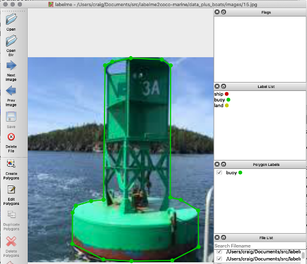

# Marine Image Segmentation using Detectron2
This repository was inspired by the following Detectron2 tutorial:

#https://colab.research.google.com/drive/16jcaJoc6bCFAQ96jDe2HwtXj7BMD_-m5

This tutorial was the backbone of this repository.

According to Facebook AI Research (FAIR), "Detectron2 is Facebook AI Research's next generation software system that implements state-of-the-art object detection algorithms".

https://github.com/facebookresearch/detectron2

## Objectives
The objective of this project is to recognize nautical features like buoys, land and other ships while at sea. We plan on installing a Jetson Xavier low power using on a boat with mounted camera to detect these features real-time and send out warnings. This project is actually a follow up to Adrian Llopart Maurin's GitHub repository using using Mask RCNN where he was able to train and predict Marine features typically encountered at sea. Adrian labeled his images to detect ships, buoys, land, sea and sky; all important to boating.

https://github.com/Allopart/Maritme_Mask_RCNN

We used Adrian's Marine image dataset as our training set too, which also includes all of his the labelme .json file labels. Adrian used a Panoptic Segmentation approach were he labeled the entire image for ships, buoys, land, sea and sky. For this repository we edited Adrian's nautical images in labelme, but eliminated sea and sky. For our next panoptic segmentation project, we will go back to Arian's complete labeling approach in the next project.

## Marine Labels
The following image is an example image that was used in the training images in labelme.

We then used Chengwei Zhang's GitHub repository to take all the individual .json files for each image from labelme and create the detectron2 necessary trainval.json file used in training by running 

  python labelme2coco.py .data/images

https://github.com/Tony607/labelme2coco

Chengwei also included a notebook that we used to evaluate and scan the individual image results called COCO_Image_Viewer.ipynb, and it too is included in this repository.

## Data used for Training
Our subset to Adrian's images are accessed from:

https://cbpetro.s3.us-east-2.amazonaws.com/api/download/data.zip

We used the following Colab notebook to train this nautical dataset on Colab:

Detectron2_custom_coco_data_instance_segmentation_marine_ver5_TRAIN_Colab.ipynb

The weights are stored in the ./output/model_final.pth during training in Colab. After training, the weights were downloaded from Colab, and we have placed these weights on AWS. 

https://cbpetro.s3.us-east-2.amazonaws.com/api/download/output.zip

We then used the following notebook to predict our nautical features like buoys, ships and land mass:

Detectron2_COCO_DataSegmentation_from_Marine_checkpoints.ipynb

or you can use the following python code in Spyder:

Detectron2_COCO_DataSegmentation_from_Marine_checkpoints.py

